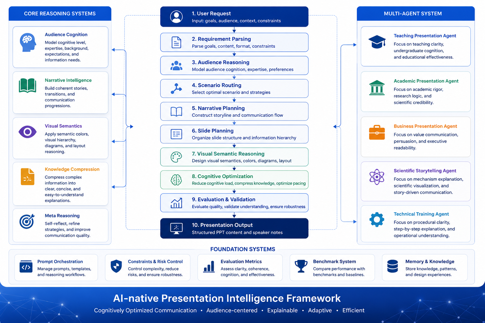

<p align="center">
  
</p>
# PPT Cognitive Design Skill

> An AI-native presentation intelligence framework for cognitively optimized communication.

---

# Overview

PPT Cognitive Design Skill is a research-oriented AI framework designed to transform presentation generation from:

- slide decoration

into:

- cognitive communication intelligence.

The framework integrates:

- audience-centered reasoning
- narrative intelligence
- semantic visual systems
- cognitive optimization
- explainable presentation AI
- multi-agent orchestration

The goal is to help AI systems generate presentations that audiences understand naturally.

---

# Core Philosophy

Presentation quality is NOT determined by:

- animation complexity
- decorative density
- visual overload

Presentation quality IS determined by:

- audience understanding
- cognitive clarity
- narrative continuity
- semantic communication
- explanation efficiency

---

# Core Capabilities

## Audience-centered Reasoning

- audience cognition modeling
- expertise estimation
- pacing adaptation
- terminology control

---

## Narrative Intelligence

- storyline construction
- narrative pacing
- transition optimization
- progressive explanation

---

## Cognitive Optimization

- cognitive load reduction
- knowledge compression
- readability optimization
- hierarchy stabilization

---

## Semantic Visual Intelligence

- semantic color systems
- visual hierarchy reasoning
- diagram-oriented communication
- visual rhythm optimization

---

## Multi-agent Presentation Intelligence

Supports:

- teaching presentation agents
- academic defense agents
- scientific storytelling agents
- business pitch agents

---

# Framework Architecture

```text
User Request
    ↓
Requirement Parsing
    ↓
Audience Reasoning
    ↓
Scenario Routing
    ↓
Narrative Planning
    ↓
Slide Planning
    ↓
Visual Semantic Reasoning
    ↓
Cognitive Optimization
    ↓
Evaluation & Validation
    ↓
Structured Presentation Output
```

---

# Repository Structure

```text
reasoning/      → cognitive reasoning systems
decision/       → routing and strategy systems
evaluation/     → evaluation and benchmark systems
prompts/        → AI execution prompts
templates/      → slide-type intelligence
examples/       → workflow demonstrations
visual/         → semantic visual systems
```

---

# Example Use Cases

The framework supports:

- teaching interviews
- undergraduate teaching PPTs
- academic defense presentations
- scientific storytelling
- interdisciplinary communication
- business presentations
- technical training systems

---

# Quick Start

## 1. Read the framework overview

```text
README.md
```

---

## 2. Understand the architecture

```text
SYSTEM_ARCHITECTURE.md
SYSTEM_PIPELINE.md
```

---

## 3. Learn the interaction protocol

```text
INPUT_PROTOCOL.md
```

---

## 4. Explore examples

```text
SHOWCASE.md
examples/
```

---

# Recommended Reading Paths

## For Researchers

```text
RESEARCH_POSITIONING.md
BENCHMARKS.md
VALIDATION.md
VISION.md
```

---

## For Contributors

```text
CONTRIBUTING.md
REPOSITORY_MAP.md
```

---

## For Developers

```text
DEPLOYMENT.md
prompts/
reasoning/
evaluation/
```

---

# Research Positioning

The framework lies at the intersection of:

```text
AI
+ Cognitive Science
+ Educational Communication
+ Narrative Intelligence
+ Human-centered Design
```

---

# Long-term Vision

The framework aims to evolve toward:

- adaptive presentation agents
- multimodal communication intelligence
- cognition-aware educational AI
- explainable presentation systems
- autonomous presentation orchestration

---

# Final Principle

The future of presentation intelligence is not:

better slides.

It is:

better understanding.
